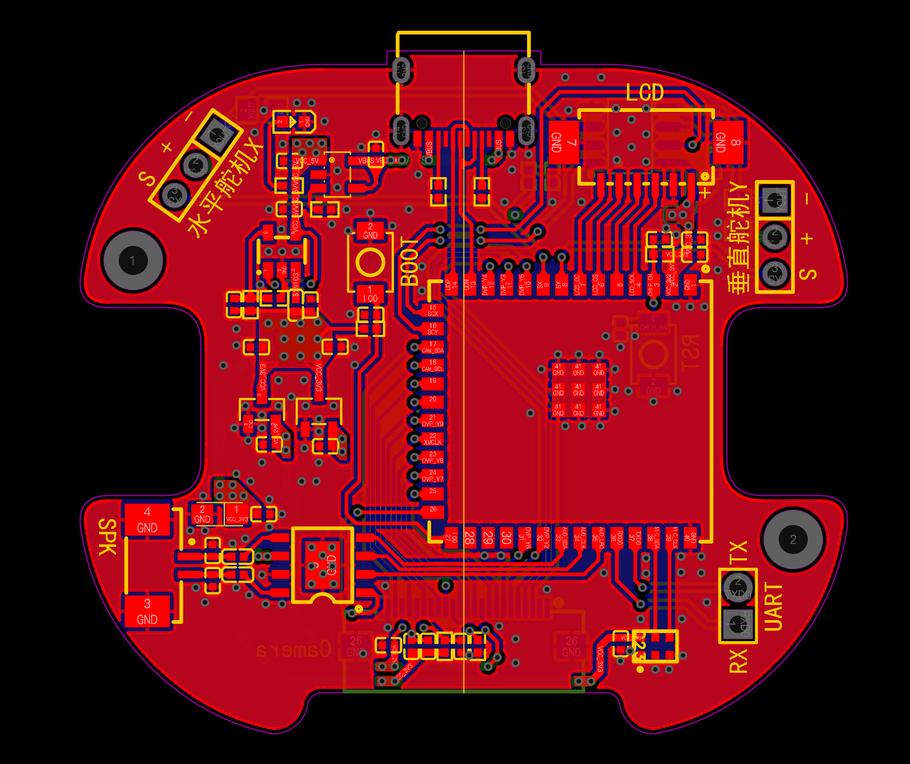
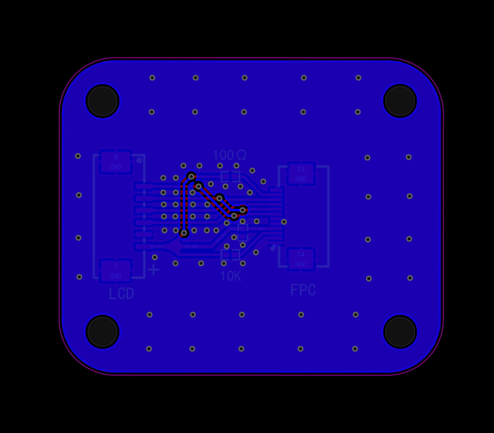

# Brufik in One — 一个住在你桌面的硅基朋友

你好！这里有一个**硅基朋友**，你想认识一下吗？

他会睁大眼睛看着你说话，被夸奖时害羞脸红、眨眼睛，被吵醒时一脸迷糊；他记得你说过的话——知道你喜欢喝咖啡，下午 3 点会主动提醒你「该站起来活动啦」；你问他天气，他真的会去网上查，查完还得意地晃两下脑袋；你打断他说话，他会乖乖停下来听你说。

他不是视频里的 demo，而是**开源、可以亲手攒出来**的：3D 打印外壳 + ESP32 主控 + 一块小屏幕 + 两个舵机 + 一个喇叭，配上一套全开源的语音 AI 后台，百元级预算就能从零到「活」。


---

## 为什么值得一试

- 🗣️ **开口即聊，无唤醒词**：插电上电，直接对它说话。VAD 自动起停，不用按键、不用喊「你好小歪」。
- 😊 **表情 + 音素级口型**：TTS 返回音素时间戳，屏幕上的嘴型逐帧对齐声音；语音、嘴型、底部屏显文字三路同步。
- 🎙️ **全双工音频（AEC）**：它说话时你可以直接打断——回声消除（ESP-SR AFE）让它「边听边说」，而不是死板地你一句我一句排队。
- ⚡ **随时打断**：高优先级消息（如闹钟、紧急提醒）通过 `pb_cancel` 抢占，立刻打断低优先级播放。
- 👀 **认人 + 追视**：认得的脸能叫出名字（MediaPipe 检测 + InsightFace 512 维档案），摄像头自动转头跟随。
- 🌐 **LLM 工具生态**：联网搜索、抓网页、拍照取景、登记人脸、读写文件沙箱……LLM 不只聊天，还能动手。
- 📦 **全栈开源**：STEP 结构件、PCB、自定义 bootloader、ESP32 固件、Python 后台、Web 控制台，一套仓库交付，可完整复刻。

---

## 它怎么「活」起来

设备端「轻」、后台端「重」：ESP32 只负责采音、播音、画屏、转舵机；所有智能（识别、对话、人脸、记忆、定时）都在后台。两者通过**一条 WebSocket 长连接**（`/asr_chat`）实时联动。

```
你说话 → 设备采集 PDM 麦克风（16kHz）
              │  audio 帧上行（Opus/PCM + flush）
              ▼
        服务端语音管线：VAD → ASR → LLM(工具) → TTS → 组帧
              │  pb_start / pb_chunk / pb_end + 24kHz PCM 下行
              ▼
        设备端回应：播音 + 嘴型 + 转头 + 屏显文字 + RGB 状态灯
```

> 详细协议见 [service/docs/esp32_pb_protocol.md](service/docs/esp32_pb_protocol.md)。

---

## 仓库结构

| 目录 | 角色 | 内容 |
|------|------|------|
| [`hardware/`](hardware/) | 实体机器人 | ESP32-S3 固件（FreeRTOS 多任务）、机械结构件（STEP/说明书）、PCB 设计文件（Gerber/BOM，V2.0 双板）、自定义 bootloader / 分区表、烧录脚本 |
| [`service/`](service/) | 大脑（后台） | deskbot-server 主服务（WS + Web 控制台）、VAD/ASR/LLM/TTS 语音管线、人脸识别、记忆与定时任务、协议文档 |

---

## 🔧 自己动手做一台

硬件全部开源：两块 **PCB V2.0**（主控 Base + 屏幕 LCM）+ 3D 打印结构件 + 通用小零件，按下面清单采购即可。详细组装步骤见 [图文说明书](hardware/mechanical/小歪v2.0组装说明书PDF.pdf)，接线表与烧录见 [hardware/README_zh.md](hardware/README_zh.md)。

### 购买材料清单（每套）

| 类别 | 品名 | 规格 | 每套用量 | 说明 |
|------|------|------|----------|------|
| 硬件 | 屏幕 | 1.83英寸TFT液晶屏ST7789小屏240x284显示器LCD彩屏SPI圆角 | 1 | 12p插接 无触摸 |
| 硬件 | 摄像头 | ov3660异面120°广角40mm长 | 1 | — |
| 硬件 | 扬声器 | 2011腔体喇叭8欧1瓦 | 1 | 1.25插头 |
| 硬件 | 9g舵机 | 180°舵机 | 1 | JR2.54插口 |
| 硬件 | 3.7g舵机 | 长宽尺寸20.2*8.5mm | 1 | 1、工作电压必须满足5v；2、长宽20.2*8.5mm（允许±0.5mm公差，一般都是这种规格）；3、JR2.54插口 |
| 硬件 | FPC天线 | FPC天线 IPEX 1代接头 线长5cm 尺寸28*9mm | 1 | 尺寸越大信号越好，但是不得大于30*30mm |
| 硬件 | 屏幕PCB | 详见 PCB sheet | 1 | 即 **PCB V2.0 LCM** |
| 硬件 | 主控PCB | 详见 PCB sheet | 1 | 即 **PCB V2.0 Base** |
| 辅料 | M2*5自攻螺丝 | 十字盘头不锈钢平尾 | 14 | — |
| 辅料 | M2*8自攻螺丝 | 十字盘头不锈钢平尾 | 9 | — |
| 辅料 | M2*12自攻螺丝 | 十字盘头不锈钢平尾 | 2 | — |
| 辅料 | 连接线 | 1.25 6p 150mm 双头同向硅胶线 | 1 | 双头同向，见[示意图](hardware/mechanical/连接线_双向同头示意图.png) |

### PCB 与 3D 结构件

**主控 PCB（PCB V2.0 Base）**——ESP32-S3-WROOM-1U-N16R8 + 板载麦克风 / NS4168 功放 / TYPE-C： [Gerber](hardware/mechanical/小歪_Gerber_PCB_V2.0_Base_2026-09-02.zip) · [BOM](hardware/mechanical/BOM_V2.0_Base_PCB_V2.0_Base_2026-09-02.xlsx)



**屏幕 PCB（PCB V2.0 LCM）**——屏幕转接板，FPC 与主控相连： [BOM](hardware/mechanical/BOM_V2.0_LCM_PCB_V2.0_LCM_2026-09-02.xlsx)



- **3D 打印件（STEP）：** [`小歪机器人v2.0打印件stp.stp`](hardware/mechanical/小歪机器人v2.0打印件stp.stp)
- **摄像头卡子（OV3660 固定）：** [`小歪机器人v2.0 ov3660摄像头卡子.stp`](<hardware/mechanical/小歪机器人v2.0 ov3660摄像头卡子.stp>)

---

## 快速开始

### 🧪 方式 A：没有硬件，5 分钟跑通语音对话

只需一台带 Python 的电脑（Ubuntu 22.04/24.04、macOS 或 Windows Git Bash），用模拟客户端代替机器人，把整条语音管线跑起来：

```bash
# 1. 安装系统依赖（Ubuntu；macOS 用 brew install ffmpeg python@3.11）
sudo apt install -y python3.11 python3.11-venv python3.11-dev ffmpeg curl git

# 2. 准备配置（默认全部免费本地模型，无需任何云 Key；用云端模型时再在 .env 配置）
cd service
cp .env.example .env

# 3. 一键启动（自动建 venv、下载 ASR 模型，拉起主服务 + Web 控制台）
chmod +x start.sh
./start.sh
```

首次启动约需数分钟（本地 ASR 模型约 900MB）。启动后：

| 服务 | 地址 |
|------|------|
| Web 控制台 | `http://<本机IP>:9000/` |
| 设备 WebSocket | `ws://<本机IP>:9000/asr_chat?device_id=<设备ID>` |

另开一个终端，用模拟客户端发一段 16kHz 单声道 WAV，体验「识别 → LLM → TTS → pb 下行」全流程：

```bash
source .venv/bin/activate
python tools/test_client.py \
  --ws-url "ws://127.0.0.1:9000/asr_chat?device_id=deskbot_dev" \
  --input-wav demo_16k_mono.wav
```

> WAV 须为 **16 kHz / mono / s16le**。没有现成 WAV？可以用麦克风现场录一段：
>
> ```bash
> # macOS：avfoundation；Linux：alsa
> ffmpeg -f avfoundation -i ":0" -ar 16000 -ac 1 -c:a pcm_s16le demo_16k_mono.wav
> ```
>
> 嫌麻烦可以直接用麦克风实时对话：`python tools/live_mic_client.py --ws-url "ws://127.0.0.1:9000/asr_chat?device_id=deskbot_dev"`（详见 [tools/README.md](service/tools/README.md)）。

### 🤖 方式 B：完整部署（后台 + 真机）

**后台**与方式 A 完全相同；之后烧录固件：

```bash
cd hardware
# 1. 编辑 firmware/deskbot_config.h：WiFi（WIFI_DEFAULT_SSID/PASSWORD）与
#    DESKBOT_WS_HOST / DESKBOT_WS_PORT（指向你的后台）
# 2. 烧录 + 串口监视（需 PlatformIO，Python ≥3.10）
./flash_rom.sh all
```

上电后机器人自动连 WiFi 并显示状态；连不上时自动开开放热点（SSID = 设备 ID），浏览器打开 `http://192.168.4.1/` 网页配网。

设备 ID 由芯片 MAC 生成（如 `deskbot_e83dc1faea30`），设备链路**只需 device_id，不需要 API Key**——把同一 ID 在控制台「我的设备」里绑定到你的账号，即可管理它的记忆、定时任务与人脸档案。

---

## 和它玩什么

| 玩法 | 说明 |
|------|------|
| 🗣️ 自然对话 | 多轮上下文（10 分钟会话），人设「小歪」，情绪丰富、会害羞会傲娇 |
| 📅 定时提醒 | 说「提醒我 3 点喝水」，LLM 调用 `schedule_task`，到点主动播报（北京时区 cron） |
| 🧠 记住你 | 说「我叫小明，喜欢喝咖啡」，`memory_add` 写入长期记忆，跨会话生效 |
| 😊 情绪表达 | 被夸奖会害羞眨眼，被凶会委屈炸毛；表情、转头、语音联动 |
| 👁️ 认人 + 跟随 | `register_face` 登记人脸，之后能叫名字；摄像头自动追脸转头 |
| 🌐 联网 | 「帮我查一下明天的天气」——`webfetch` / `websearch` 后回答 |
| 📝 屏显文字 | 语音之外，它还可以在屏幕上用彩色文字「写」给你看 |
| 🛠️ 调试台 | 控制台里不经过设备直接试 LLM、试 TTS、跑整轮模拟 |

---

## 技术速览（与代码一致）

### 语音管线（`service/config.yaml` 可调）

**免费本地优先**：VAD / ASR / LLM / TTS 默认全部在本机运行，零 API 费用；云端收费模型可在 `service/config.yaml` 或控制台「机器人设置」按需切换。

| 环节 | 实现 | 说明 |
|------|------|------|
| VAD | Silero VAD（ONNX，本地） | 端点检测，自动起停 |
| ASR | FunASR · SenseVoiceSmall（本地 ONNX） | 中文，16kHz，支持 Opus/PCM |
| LLM | **本地优先**：Qwen3.8-2B（llama-server，端口 9106）或 MiniCPM5-1B（端口 9105），OpenAI 兼容协议；可切换云端火山方舟（DeepSeek 等）/ OpenAI / DashScope | 多轮工具循环，JSON 输出 |
| TTS | **本地优先**：MOSS-TTS-Nano；可切换云端豆包 Doubao | 返回音素时间戳，驱动屏幕口型 |
| 组帧 | pb wire：音频 + 动画 + 舵机 + 屏字 | 24kHz s16le PCM，优先级队列（0 空闲/1 说话/2 紧急/3 调试） |

### 设备 WebSocket 协议

单条持久连接，上行、下行均采用 **「JSON + 紧随一条 binary」**（长度由 `next_bin_len` 声明，不用 base64）：

- **上行**：`audio`（+flush 触发识别）、`camera_frame`（可选 JPEG）、`pb_ack`（播放背压）、`ping`
- **下行**：`pb_start` / `pb_chunk` / `pb_end` / `pb_single` + 24kHz PCM；`pb_cancel` 支持抢占打断

### LLM 工具（`llm_tool_runner.py` / `web_tools.py`）

`schedule_task`（定时提醒）· `memory_add` / `memory_del`（长期记忆）· `get_camera`（取画面）· `register_face`（登记人脸）· `set_camera_follow`（人脸跟随）· `webfetch` / `websearch`（联网）· 沙箱文件读写 · `interim_tts`（边说边想）

### 固件要点（`hardware/firmware/`）

- 主控 **ESP32-S3**（当前固件适配自研 Deskbot v2 板，由 Seeed XIAO ESP32S3 Sense 方案移植）
- 外设：ST7789P 240×284 SPI 屏 · 双轴舵机（X 左右 GPIO16 / Y 上下 GPIO15）· PDM 麦克风 · NS4168 I2S 功放 · OV2640/OV3660 120° 广角摄像头（esp_camera 自动识别）· RGB 状态灯
- **ESP-SR AFE**（AEC 回声消除 / NS 降噪 / AGC / VAD）→ 全双工音频，可打断
- 自定义 bootloader 钩子，避免上电/烧录时舵机误触发抽动
- 工具链：pioarduino 55.03.39 · Arduino-ESP32 3.3.9 + ESP-IDF 5.5.4 · Python ≥3.10

### 数据与隔离

SQLite（`opendesk.db`）存用户、设备绑定、定时任务；记忆、会话、人脸档案按设备目录隔离（`data/<device_id>/`）。本地调试工具的 Web / HTTP / 调试订阅可用免费体验 Key（`data/.free_api_key`，详见 [service/README.md](service/README.md)）。

---

## 文档索引

| 文档 | 内容 |
|------|------|
| [service/README.md](service/README.md) | 后台部署、使用手册、与 ESP32 交互概要 |
| [service/docs/esp32_pb_protocol.md](service/docs/esp32_pb_protocol.md) | ESP32 通信、鉴权、pb 协议 |
| [service/docs/SERVER.md](service/docs/SERVER.md) | 主服务 API、配置、LLM 工具 |
| [service/docs/api_interfaces.md](service/docs/api_interfaces.md) | Web 控制台与设备服务接口清单 |
| [service/docs/ARCHITECTURE.md](service/docs/ARCHITECTURE.md) | 后台代码分层与模块 |
| [service/tools/README.md](service/tools/README.md) | 本地联调脚本（模拟客户端 / 麦克风实时测试） |
| [hardware/README_zh.md](hardware/README_zh.md) | 固件烧录、元器件采购清单、组装与接线说明 |

## 许可证

- **硬件设计**（[`hardware/mechanical/`](hardware/mechanical/)）：CERN-OHL-S-2.0
- **固件**（[`hardware/firmware/`](hardware/firmware/)）：GPL-3.0
- **后台**（[`service/`](service/)）：GPL-3.0

各子目录内有对应 `LICENSE` 文件。
